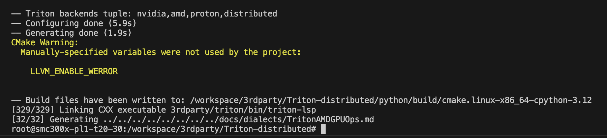
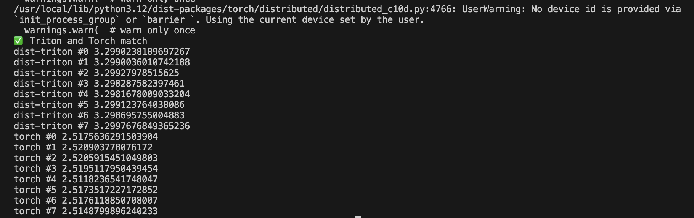

# Build Triton-distributed (RocSHMEM)

## The best practice to use Trition-distributed in AMD GPU

- ROCm 6.3.3
- torch-2.6/2.8 (torch-2.6 has major improvement, compatible with SGLang, vLLM)
- python3.12.8
- MI300X/MI325X

Dependencies with other versions may also work well, but this is not guaranteed. If you find any problem in installing, please tell us in Issues.

## Setup without docker

1. make sure torch-rocm is installed for ROCm SDK 6.3.3
    ```sh
    pip3 install --pre torch torchvision torchaudio --index-url https://download.pytorch.org/whl/nightly/rocm6.3
    ```
2. install ompi for ROCm SDK
    ```
    sudo apt-get update -y && \
    sudo apt install -y libopenmpi-dev
    ```
3. install other dependencies
   ```
   python3 -m pip install -i https://test.pypi.org/simple hip-python~=6.3.3 # or whatever Rocm version you have
   pip3 install pybind11
   ```

#### Warnning of install inside existing dockder

Make sure following repositories granted permission to clone submodules

```
# /workspace/3rdparty/ point to the parent folder you cloned for `Triton-distributed`
git config --global --add safe.directory /workspace/3rdparty/Triton-distributed/3rdparty/rocshmem
git config --global --add safe.directory /workspace/3rdparty/Triton-distributed/3rdparty/triton
git config --global --add safe.directory /workspace/3rdparty/Triton-distributed

git submodule update --init --recursive
```

## Build

> python3 python/setup.py build_ext



## Test

Currently only single node build supported, multi-node build will be supported soon.

- Single node test
  ```
  bash ./scripts/launch_amd.sh python/triton_dist/test/amd/test_ag_gemm_intra_node.py 8192 8192 29568
  ```

  